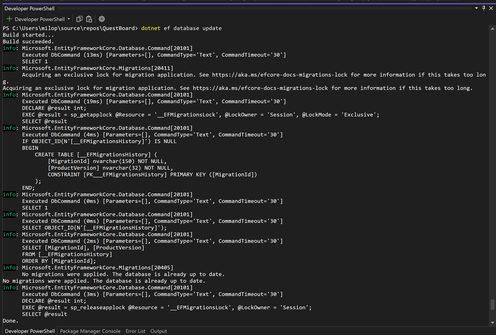

🎮 QuestBoard

A Player’s Journal for Games, Goals, and Progress

Project Summary

QuestBoard is a web app built with ASP.NET Core MVC that lets players track their gaming goals, progress, and play sessions in one place.
It’s designed as both a lightweight productivity tool for gamers and a demonstration of clean architecture, data modeling, dependency injection, CRUD functionality, logging, diagnostics, and cloud deployment.

Over the course of several weeks, the app evolves from a basic EF Core data model into a full-featured MVC application with structured logging, health checks, and a final deployment to Azure App Service. The project showcases modern web development practices using C#, Razor Views, and Entity Framework Core.

Planning Table:
| **Week** | **Concept**                        | **Feature**                                                                     | **Goal**                                                              | **Acceptance Criteria**                                                                                                                             | **Evidence in README.md**                                                                                                     | **Test Plan**                                                                                                                 |
| -------- | ---------------------------------- | ------------------------------------------------------------------------------- | --------------------------------------------------------------------- | --------------------------------------------------------------------------------------------------------------------------------------------------- | ----------------------------------------------------------------------------------------------------------------------------- | ----------------------------------------------------------------------------------------------------------------------------- |
| **10**   | **Modeling**                       | Create `Player`, `Game`, `Quest`, and `PlaySession` entities with relationships | Persist players, games, and play sessions                             | ✅ EF Core migration creates tables  ✅ Relationships (Player→Quests, Player→PlaySessions, Game→Quests, Game→PlaySessions) ✅ Seed sample data   | Implemented code + migration files  Short schema note (keys, required fields)  Screenshots of tables and seed data      | Run migration; verify tables and relationships in SQL Server or LocalDB; confirm sample data loads correctly                  |
| **11**   | **Separation of Concerns / DI**    | Add `IProgressService` to calculate player progress (quest completion %)        | Move calculation logic out of controllers into a service              | ✅ Interface + implementation  ✅ Registered in DI container  ✅ Returns accurate progress metrics                                               | Code snippet of DI setup; ~200-word write-up on service layer; screenshot of controller calling the service and sample output | Unit tests for `ProgressService` covering edge cases (no quests, partial completions, time range calculations)                |
| **12**   | **CRUD**                           | Add Create/Edit/Delete forms for `Quest`                                        | Players can define and manage their in-game goals                     | ✅ Create/Edit forms render correctly  ✅ Validation messages show for required fields  ✅ Saves to DB and redirects (Post-Redirect-Get pattern) | Implemented forms and controller methods; screenshots of validation and final quest list; short PRG explanation               | Integration test: POST valid quest → 302 redirect → quest appears in list  POST invalid → same view with validation errors |
| **13**   | **Diagnostics**                    | Add `/healthz` endpoint                                                         | Provide a liveness check to verify app health                         | ✅ `/healthz` returns 200 OK  ✅ Startup log shows current environment (Development / Production)                                                  | Curl or browser screenshot of `/healthz` = OK; startup log snippet in README                                                  | Manual curl test; stop DB to observe behavior; confirm “OK” for basic liveness                                                |
| **14**   | **Logging**                        | Add structured logs for quest creation and session activity                     | Trace user actions and app behavior for diagnostics                   | ✅ `ILogger` logs Information for Create/Edit/Delete  ✅ Log includes `QuestId`, `PlayerId`, `GameId` and timestamp                                | Log output screenshot + code snippet showing logger usage; explanation of log levels (Information, Warning, Error)            | Manual test: perform Create/Edit/Delete actions and verify log entries in Output window or console                            |
| **15**   | **Stored Procedures**              | Call stored procedure “Top 5 Games by Hours Played”                             | Generate a server-side leaderboard query using SQL SP for performance | ✅ Stored procedure executes successfully  ✅ Mapped to a ViewModel  ✅ Results render on a Leaderboard page                                     | Screenshot of SP result and EF Core execution snippet; short write-up comparing SP vs LINQ performance                        | Compare SP output to LINQ query results on same dataset for validation                                                        |
| **16**   | **Deployment (Azure App Service)** | Deploy QuestBoard to Azure App Service with CI/CD                               | Make the app publicly accessible and maintainable                     | ✅ Azure App Service created  ✅ App builds and runs in cloud  ✅ `/healthz` reachable online  ✅ At least one functional page works           | Screenshot of live URL and `/healthz` response; deployment notes in README; GitHub Actions config snippet                     | Visit public URL; confirm home page and `/healthz` load successfully; verify logs from production App Service                 |

---

# Week 10 — Entity Framework Core Integration (QuestBoard)

This update introduces a durable data layer for QuestBoard using Entity Framework Core and SQL Server LocalDB. The goal for Week 10 is narrow by design: define the domain model, register it in the application, create a migration that matches the model, and prove that the database builds and stores rows. The UI and extra features stay out of scope so the foundation is stable for later weeks.

- **Entities**
  - **Game** — `Id, Name, Genre, CreatedAt`
  - **Player** — `Id, Name, Class, Level, GameId` (each player belongs to one game)
  - **Quest** — `Id, Title, Description, RewardGold, Difficulty, GameId` (each quest belongs to one game)
  - **PlayerQuest** — join table for the many-to-many between players and quests (`PlayerId, QuestId, AcceptedAt, IsCompleted`)

- **DbContext**
  - `QuestBoardContext` exposes `DbSet<Game>`, `DbSet<Player>`, `DbSet<Quest>`, and `DbSet<PlayerQuest>`.
  - Relationships configured in `OnModelCreating`:
    - Composite primary key on `PlayerQuest (PlayerId, QuestId)`.
    - `Game → Players` and `Game → Quests` use **Cascade**.
    - `PlayerQuest → Player` and `PlayerQuest → Quest` use **Restrict/NoAction** to avoid SQL Server’s “multiple cascade paths” error.

- **Migrations**
  - A migration was created and applied to generate the four tables above.
  - The database builds without errors; proof screenshots are included.

## How to run locally

1. Ensure the .NET SDK and Visual Studio (with ASP.NET workload) are installed.  
2. The default connection string in `appsettings.json` targets LocalDB:  
   `Server=(localdb)\\MSSQLLocalDB;Database=QuestBoardDb;Trusted_Connection=True;MultipleActiveResultSets=true;TrustServerCertificate=True`
3. Build the schema:
   - **Visual Studio:** *Tools → NuGet Package Manager → Package Manager Console* → `Update-Database`
   - **or** terminal at the project folder: `dotnet ef database update`
4. Start the app:
   - **Visual Studio:** press **F5**
   - **or** terminal: `dotnet run`
5. Browse to `https://localhost:<port>/`. If you scaffolded CRUD, visit `/Games`, `/Players`, `/Quests` to create and view rows.

## Verifying the database

- **SQL Server Object Explorer** → `(localdb)\MSSQLLocalDB → Databases → QuestBoardDb → Tables`  
- Right-click **Games**, **Players**, **Quests**, **PlayerQuests** → **View Data**.  
- You should see actual values (not just null placeholders). Screenshots below capture the exact state used for submission.

## Evidence (screenshots)

- 
- 
- 
- 

## File pointers

These filenames are present in the project:
- **DbContext:** `QuestBoardContext.cs`
- **Entities:** `Game.cs`, `Player.cs`, `Quest.cs`, `PlayerQuest.cs`
- **Relationships & seeding:** inside `OnModelCreating` in `QuestBoardContext`
- **Migrations:** files under the `Migrations` folder (initial schema + fixes)

> Exact relative paths can vary by solution layout (for example, you might keep the app under `src/`); the filenames above are consistent.

## Notes for later weeks

The model is intentionally minimal. Future work can build on this layer by adding view models, services, and pages for assigning quests to players. Because the delete behavior was set deliberately (Cascade at Game, Restrict at the join), future changes won’t fight SQL Server’s multiple-cascade rule.

## Submission links

- **Repository (entities, DbContext, migration commits):** link to this branch/PR.  
- **Week 10 README:** this file, `README.week10.md`, in the repository root.

---
## Week 11 – Separation of Concerns / Dependency Injection

This week I implemented a service layer and integrated it via ASP.NET Core’s built-in Dependency Injection (DI) to separate non-UI logic from MVC controllers. The goal was to keep controllers thin and move data access and business logic into a dedicated service that can be reused and tested independently.

I added an IPlayerService interface and a PlayerService implementation. The service encapsulates queries such as listing all players with their related Game, retrieving a single player with related Game and Quests, creating, updating, and deleting players, as well as a simple business method (GetTopByLevelAsync) that returns the top N players by level. The service uses the existing QuestBoardContext from Entity Framework Core and is registered with the DI container using AddScoped, which is the recommended lifetime for EF Core per-request usage.

In PlayersController, I replaced direct data access with calls to the service, leaving UI-focused responsibilities (like populating dropdowns for Game selection) inside the controller. As a result, the controller methods are shorter, easier to read, and focused on HTTP + view concerns. The PlayerService centralizes data logic and query shape, which is better for maintainability and reduces duplication across the codebase.

This pattern directly supports real-world needs: services can be unit tested with an in-memory database or mocked interfaces; swapping implementations (e.g., caching, auditing, or API-based data) becomes straightforward; and the controller remains stable as behavior evolves. The new /Players/Top endpoint demonstrates how adding features now primarily means extending the service rather than complicating the controller.

How to verify:
1) Run the app → Players.
2) Click “Show Top 3 Players” or use the Top form.
3) Create/Edit/Delete still work as before; data persists in SQL Server.

Evidence:
- Service: `Services/IPlayerService.cs`, `Services/PlayerService.cs`
- DI: `Program.cs` (AddScoped)
- Controller usage: `Controllers/PlayersController.cs`
- UI Entry: `Views/Players/Index.cshtml`

Screenshots:
- 
- 
- 

---

### Week 12 – CRUD (Vertical Slice: Quests)

This week I implemented a full CRUD slice for Quests using async EF Core, a service layer, and validation on create/edit. I added a QuestsController with Index (list), Details (read), Create, and Edit actions. The controller calls IQuestService, which performs async data access with ToListAsync, FirstOrDefaultAsync, and SaveChangesAsync. For forms, I used a QuestEditViewModel with data annotations so invalid input (missing title, missing game/player) shows validation messages and blocks the POST. The Create and Edit views include asp-validation-summary and asp-validation-for to surface errors cleanly.

I kept the UI simple: Index lists quests with game, player, due date, and a quick link to Details/Edit. Create and Edit use dropdowns populated from Game and Player via the service. The service also logs a few basic actions so I can confirm the flow. This slice is intentionally narrow but complete end-to-end, which sets up Weeks 13–14 to add diagnostics and logging around the same path without changing the behavior.

Acceptance Criteria
- Async data access: ToListAsync / FirstOrDefaultAsync / SaveChangesAsync
- Validation feedback appears on Create/Edit when inputs are invalid
- List + Detail read paths work
- At least one write action works (Create and Edit implemented)

Evidence
- Controller, services, view models, and views are in the repository under their folders
- Screenshots of Create validation, Index list, and Details page (in /docs/week12/)
- Commits linked from this section

Test Plan
- Try creating a quest without a Title; expect validation error
- Create a valid quest; expect redirect to Details and success message
- Edit the quest’s IsCompleted or DueDate; expect update to persist
- Search in Index to confirm list filtering still works

---

### Week 13 – Health Checks

For Week 13, the goal was to add a diagnostic health endpoint to the QuestBoard application and verify that the app can report its own readiness. This included creating a /healthz route and adding a real dependency check against the database. The endpoint needed to return simple JSON that helps with troubleshooting but does not expose any connection strings or other sensitive information. The /healthz endpoint now performs two checks:

General application health

Database connectivity check using the existing QuestBoardContext

If the application can successfully communicate with the database, the endpoint returns Healthy. If the database is unreachable, it returns Unhealthy along with a short diagnostic message.

### Week 14 - Logging

This week’s task was to implement structured logging throughout key execution paths in the QuestBoard application. The main goal was to make sure the app records useful information during normal operation as well as during error conditions. This helps when troubleshooting issues, and it mirrors what real production systems do to monitor behavior and diagnose failures.
I added logs to two paths:

1. A success path – when a quest is created successfully.
2. An error or warning path – when the incoming model state is invalid or when a quest fails to load.

What Was Implemented

Added ILogger<QuestsController> through dependency injection.

Wrote structured logs in:

Create POST (success and validation failure)

Index (request start)

Edit GET (quest not found)

Ensured logs include useful identifiers such as:

Quest ID

Title

Correlation/request ID

Search term when applicable

Test Plan

1. Run the app and open the Output window (Debug + ASP.NET Core logs).

2. Create a new quest with valid input to verify the success log shows quest ID, title, and correlation ID.

- 

3. Attempt to create a quest with missing required fields to verify the warning log appears.

4. Manually enter /Quests/Edit/9999 to verify the “quest not found” warning is logged.

Screenshot:
- 

5. Confirm Index logs the “Quest Index requested” message each time the page loads.

### Week 15 – Stored Procedures

This week focused on adding stored procedure support to the QuestBoard project. The first task was writing a SQL stored procedure that returns “open quests” filtered by GameId. Because SQLite is used for local development, and SQLite does not support stored procedures or the EXEC keyword, the SQL script was written specifically for SQL Server and committed to the repository. The procedure selects a filtered set of quests and orders them by difficulty and Id. The script compiles without errors in SQL Server and is ready for use when the app is connected to a SQL Server instance.

Next, the OpenByGame action in QuestsController was updated to support both SQLite and SQL Server. The controller now checks the EF Core provider at runtime. If SQLite is detected, the code uses a LINQ query instead of attempting to execute the stored procedure. If SQL Server is detected, the controller uses FromSqlInterpolated() to safely pass the GameId parameter and execute the stored procedure. This prevents SQLite from throwing syntax errors while still meeting the assignment requirement to call a stored procedure when supported.

The results from either path are projected into QuestListItemViewModel and rendered through the existing Razor view. Additional logging was added to record success and error cases, including the provider name and correlation ID, making troubleshooting much easier.

Testing involved opening the route /Quests/OpenByGame?gameId=X, checking that the page renders correctly, and confirming that logs show the correct execution path (SQLite fallback or SQL Server stored procedure). The SQL script (Week15_GetOpenQuestsForGame.sql) is included in the repository under /SQL/.

Screenshots:
- 

- 

## Week 16 (Final) – Deployment (Azure App Service)

For the final feature, I deployed QuestBoard to Azure App Service.

- Hosting: Azure App Service, .NET 9 runtime, Free (F1) tier. Free trial subscription used; app may not work after Dec 2027.
- URL: https://questboard-f6a2augcawesfjf2.canadacentral-01.azurewebsites.net

- 

- Health: https://questboard-f6a2augcawesfjf2.canadacentral-01.azurewebsites.net/healthz returns “OK” and checks basic app readiness.

- 

### Configuration and secrets

- The app reads its database connection string from `ConnectionStrings:QuestBoardDb`.
- In development, this uses a local SQLite database via `appsettings.Development.json`.
- The code uses the same `QuestBoardContext` and `UseSqlite` configuration in both environments.

### What I tested

- Loaded the root page on Azure and confirmed the layout and basic navigation work.
- Hit `/healthz` and verified it returned an OK message instead of a 500.
- Opened the Games page and confirmed details render correctly using the database.
- Triggered the stored-procedure-backed feature (`/Quests/OpenByGame?gameId=1`) and verified it returns a filtered list without errors.

Additional Test Pages:
- 
- )